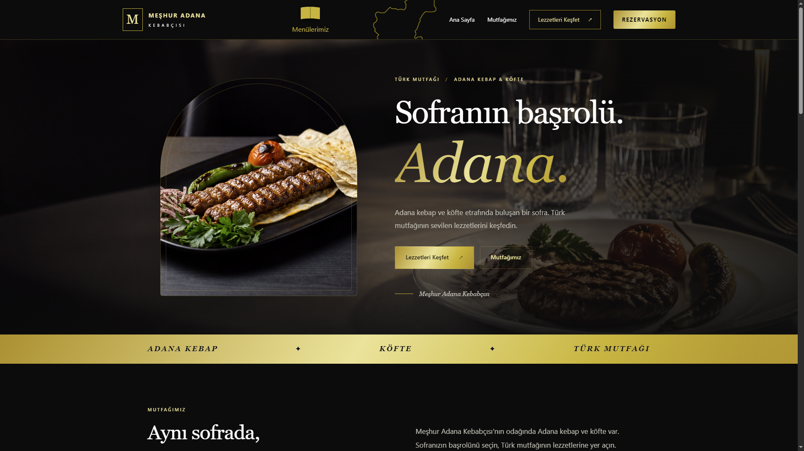
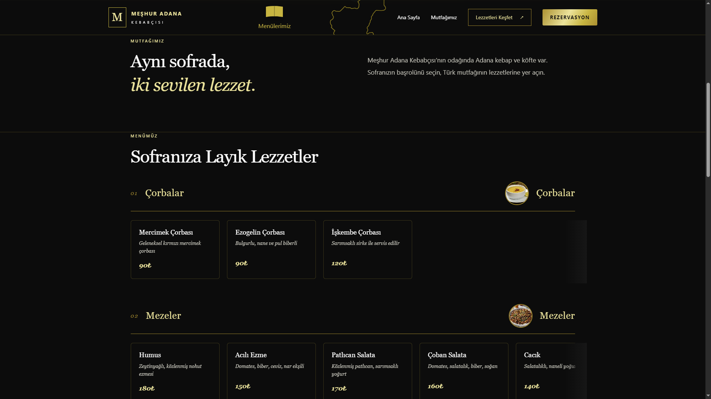
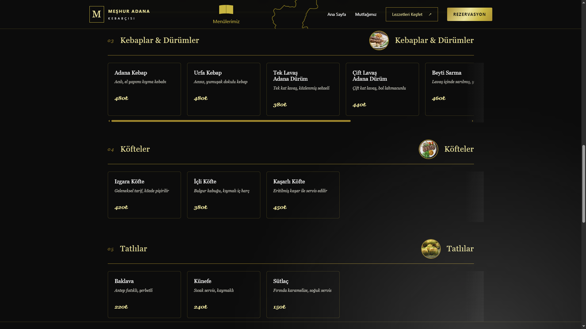
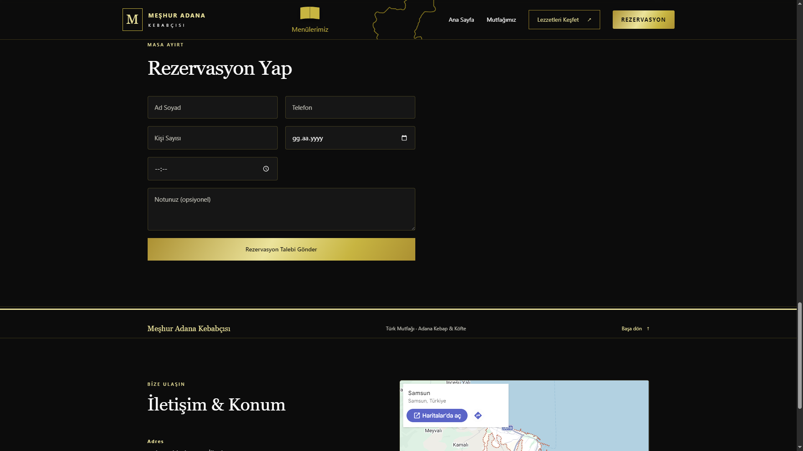
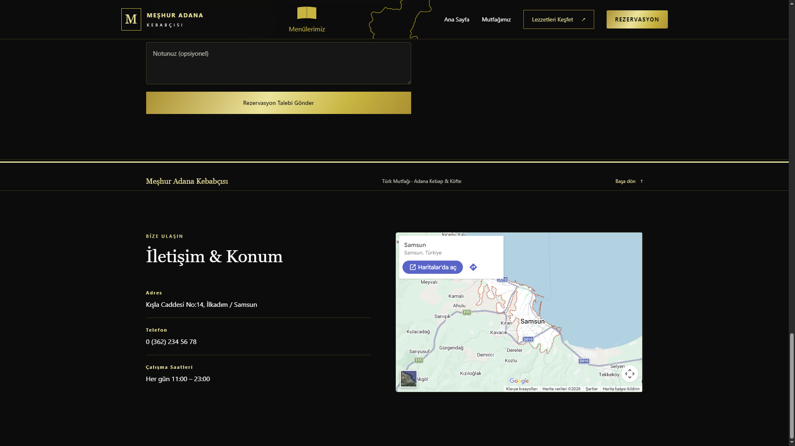

# Meşhur Adana Kebabçısı

Adana kebap ve köfte temalı, siyah/altın renk paletiyle tasarlanmış profesyonel bir restoran web sitesi. Portföy projesi olarak geliştirilmiştir.

## Özellikler

- Scroll-reveal animasyonlu, yatay kayan kart şeritli menü bölümü (5 kategori: Çorbalar, Mezeler, Kebaplar & Dürümler, Köfteler, Tatlılar)
- Herkese açık rezervasyon formu, gönderildiğinde restoran mailine otomatik bildirim (Nodemailer)
- İletişim & Konum bölümü, Google Maps entegrasyonu
- İmleç takip eden parlama efekti ve shimmer animasyonlu altın vurgu bandı
- Sitenin tamamında senkronize hareket eden yumuşak ışık efekti
- Hover'da açılan interaktif menü ikonu
- SEO meta etiketleri ve favicon

## Kullanılan Teknolojiler

**Frontend:** React (Vite)
**Backend:** Node.js, Express.js (MVC mimarisi — routes/controllers/models/middleware)
**Veritabanı:** MongoDB Atlas
**Diğer:** Nodemailer, Argon2id

## Ekran Görüntüleri

## Kurulum

## Not

Bu proje bir portföy çalışmasıdır, gerçek bir işletmeyi temsil etmemektedir.